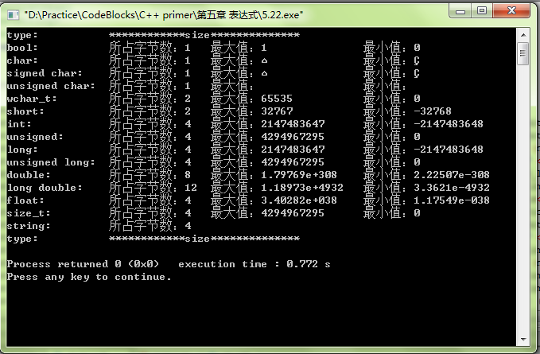
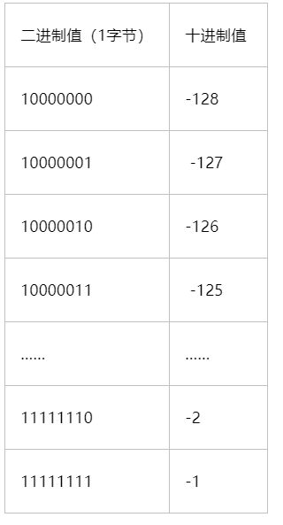

# CookBook_C++

# 0. 类型的表示范围

## 0.1 int,float,double,long double的表示范围

/#表示范围 # int #float #double #long double

reference：<https://blog.csdn.net/xuexiacm/article/details/8122267>



简单地说，1 byte = 8 bits

比如，整数类型 int 所占字节数为4，即由32 bits组成，并且int是有符号的，即有1个bit是用来表示正负的，所以

表示大小的一共有31位，所以最大值为2^31-1，最小值为 -2^31

**下表解释了有符号数是怎么表示负数的**：

reference：<https://www.cnblogs.com/lazycoding/archive/2011/03/21/unsigned-signed.html>



## 1. 数的操作

## 1.1 绝对值函数

/ #绝对值  #abs $cabs #fabs #labs

```c++
int abs(int i)  //整数
double cabs(struct complex x)  复数
double fabs(double x) //双精度浮点数
long labs(long x) //长整型数
```

## 1.2 指数/对数函数

/# log #exp

 ```
exp(n) //e的n次方
--------------------------
log(x)  //以e为底
log10(x) //以10为底
log(x)/log(a) //以a为底
 ```

